# 2025 计算机网络校内赛

本次竞赛最终结果需要提交在本网站 “算法提交” 处并查看排名。但为了方便参赛者修改和调试自己的拥塞控制算法代码，需要各位在本地配置
Transhub 运行环境，以下是安装指南（在第二节对 Transhub 代码框架进行了简单介绍）。

本次比赛设置一二三等奖及优胜奖，并设立奖金，欢迎同学们积极参与！

# Transhub 框架介绍

将 Transhub 代码克隆到本地后，大家需要关心 `/cc-training/datagrump` 目录下的内容，该目录下的内容与比赛息息相关，以下是对
`datagrump` 目录下各文件的简单介绍。

- **contest_message 文件**：规定数据报文的格式。

  在通信之前，我们需要事先在通信双方约定一个通信语法，也就是对应着一个报文格式标准，用来指定传输过程中数据的组织形式。报文格式标准没有固定的要求，唯一的要求就是发送端和接收端都接受相同的标准。

  数据报文（Packet）总体来说分为两个部分：报文头部和包内数据。报文头部主要包含描述报文特性的一些元数据，例如报文序列号、报文的发送时间等等。比赛测试场景是固定发送端和接收端，因此报文头元数据部分更加简单，具体有以下一些字段：

  `sequence_number`：数据报文的序列号

  `send_timestamp`：数据报文的发送时间

  `ack_sequence_number`：确认收到的数据报文序列号

  `ack_send_timestamp`：确认报文（ACK）的发送时间

  `ack_recv_timestamp`：确认报文（ACK）的接收时间

  `ack_payload_length`：数据报文的有效载荷大小

- **sender.cc 文件**：模拟发送端的行为。

  发送端的行为遵循两个准则，一是如果发送端还有发送窗口空余，发送端就发送更多的数据报文来填满发送窗口；二是如果发送端收到了
  ACK，处理该确认报文并通知 `controller`，进行拥塞控制。此外，如果超过了一定的时间（超时时间）发送端还没收到
  ACK，发送端会认为这个报文丢失了，会进行重传。具体细节请参看 `sender.cc` 文件。

- **receiver.cc 文件**：模拟接收端的行为。

  接收端会为收到的每个数据报文发送 ACK，`ack_sequence_number` 就是数据报文的序列号 `sequence_number`，具体细节请参看
  `receiver.cc` 文件和 `contest_message.cc` 文件中的 `transform_into_ack` 函数。

- **controller.cc 文件**：模拟进行拥塞控制的文件，也是参赛者们需要修改的文件。 有以下四个接口函数：

  `window_size()`：返回给发送端当前的发送窗口大小。

  `datagram_was_sent()`：发送端发送数据报文时调用 controller 中的该函数，参数中有 `const bool after_timeout`
  标志位，标记该报文是否是因为超时发送的。

  `ack_received()`：发送端收到 ACK 时会调用 controller 中的该函数，根据 ACK 报文中的信息，如确认序列号、数据报文的发送时间戳、ACK
  的接收时间戳等信息，计算往返时延等变量，进行拥塞控制。

  `timeout_ms()`：设置超时时间，返回给发送端。

- **run-contest 文件**：测试脚本。

# Transhub 评分标准

比赛开始后公布。

系统测试期间，Trace和评分标准可能会随时更新，显示分数不作为算法评价依据。

# Transhub 安装指南 2025 版

硬件环境：一台 Linux 主机（在本文中，Linux 主机包括运行 Linux 系统的实体机、虚拟机或云服务器）

Linux 版本要求：Ubuntu GNU/Linux 14.04 以上

**拥塞控制算法的运行示意图如下：**

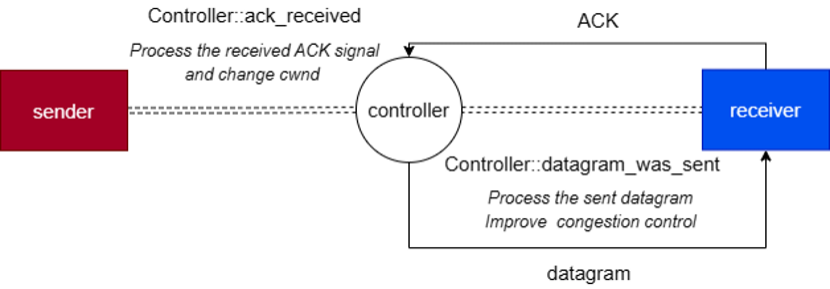

本教程提供两种安装方式，两种方式**任选其一**：

- 第一种方法为使用 Linux 虚拟机/主机，安装相关依赖，下载 transhub 代码并编译，编译完成后即可运行实验。
- 第二种方法为使用已配置好的 Docker 镜像，镜像里已装好相关依赖和代码，**开箱即用**，可**直接**运行实验。

❗ 由于以上部分依赖仅有 x86 架构的包，因此使用**Mac M 芯片**的同学需要注意，如果使用第一种方法自行安装虚拟机，需安装
x86 架构的 Linux 系统，使用 Arm 架构的虚拟机将无法安装所有依赖。建议 Mac M 芯片同学使用**Docker 方法**。

❗ 高版本 Ubuntu、WSL 存在已知问题，详情请参阅附录-常见问题。

# （一）安装 transhub

## 1.1. 方式一：使用 Linux 虚拟机/主机直接安装 transhub

> ⭐**Windows 系统推荐使用此方式**

### 1.1.1 安装 Linux 虚拟机（若直接使用 Linux 物理机可跳过此步）

- 下载 VMware 软件

参考教程：

[VMware Workstation Pro 17 官网下载安装教程\_vmware17pro 下载-CSDN 博客](https://blog.csdn.net/air__j/article/details/142798842)

官方下载链接：

[https://support.broadcom.com/group/ecx/productdownloads?subfamily=VMware%20Workstation%20Pro](https://support.broadcom.com/group/ecx/productdownloads?subfamily=VMware
Workstation Pro)

~~⭐**官方所有版本下载链接（推荐，官方渠道且无需注册账户可直接下载）：**~~

~~https://softwareupdate.vmware.com/cds/vmw-desktop/ws/~~

上述链接已失效，可访问以下链接下载：

https://github.com/yanghao5/VM-download

例如选择 17.6.2 版本：

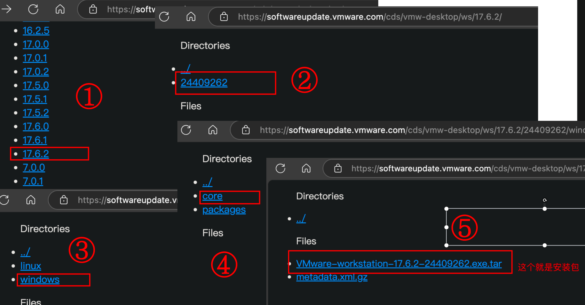

- 下载 Ubuntu 镜像（Ubuntu18 或 20、22 等版本，可根据自身需求选择。由于 vscode 限制，较老的系统版本无法使用 vscode 进行 ssh
  远程连接）

[Index of /ubuntu-releases/18.04/ | 清华大学开源软件镜像站 | Tsinghua Open Source Mirror](https://mirrors.tuna.tsinghua.edu.cn/ubuntu-releases/18.04/)

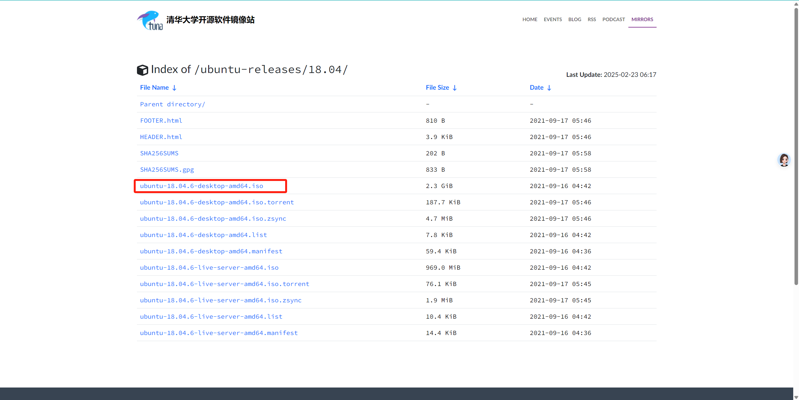

- 使用 VMware 创建 Ubuntu 虚拟机

### 1.1.2. 安装 Mahimahi

- 在其终端中运行如下代码，安装依赖项：

```bash
sudo apt-get install build-essential git debhelper autotools-dev dh-autoreconf iptables protobuf-compiler libprotobuf-dev pkg-config libssl-dev dnsmasq-base ssl-cert libxcb-present-dev libcairo2-dev libpango1.0-dev iproute2 apache2-dev apache2-bin iptables dnsmasq-base gnuplot iproute2 apache2-api-20120211 libwww-perl
```

（这些依赖项在[mahimahi / debian / control](https://github.com/keithw/mahimahi/blob/master/debian/control#L5)
中列出，另外还有一些用于比赛的依赖项）

- 下载 mahimahi 源代码

```bash
git clone https://github.com/ravinet/mahimahi
```

（Mahimahi 工具提供了我们模拟的蜂窝网络和测量工具）

- 编译并安装 mahimahi

```bash
cd mahimahi

# （用make工具编译mahimahi）
./autogen.sh && ./configure && make

# 安装
sudo make install
sudo sysctl -w net.ipv4.ip_forward=1
# 进入mahimahi
mm-delay 20
# 退出mahimahi
exit
```

（若要检查是否安装成功，可运行 `mm_delay 20`，若出现 delay 20ms 字样，说明安装成功）

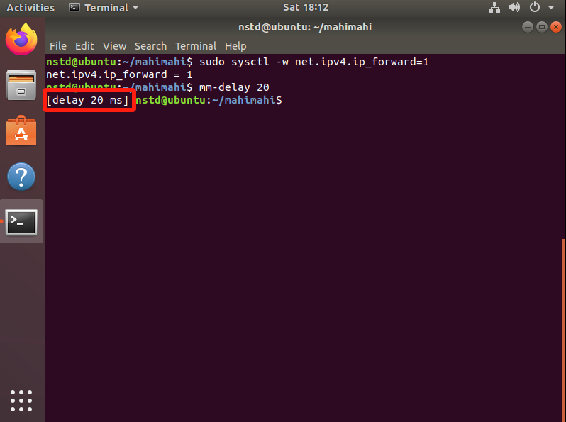

### 1.1.3. 编译 Transhub 代码

```bash
#退出mahimahi目录，回到用户目录
cd ..
#下载transhub代码
git clone https://git.ruc.edu.cn/akth/cc-training
cd cc-training
#按常规方式编译代码
./autogen.sh && ./configure && make
```

## 1.2.方式二：使用已安装好 Transhub 的 Docker 镜像

> ⭐**MacOS 系统推荐使用此方式**

> 2.1 部分仅限 Mac，Linux/Windows 平台参照对应教程安装好 Docker 后，后续方法（2.2-2.4）通用。

### 1.2.1. 安装 Docker

Linux 上如何安装使用 Docker 请自行查询相关教程，此处以 Mac 安装 Docker 为例。

❗️ 实测 Windows 使用 Docker 无法正常运行实验，请查看第五节-常见问题。

Mac 上可安装 Docker Desktop 或者 Orbstack，这里以 Orbstack 为例。

> OrbStack 是一款专为 MacOS 设计的轻量级容器和虚拟机管理工具，旨在为开发者提供快速、高效的容器化开发和测试环境。它支持
> Docker 容器和 Linux 虚拟机，特别针对 Apple Silicon（M1/M2 等 ARM 芯片）进行了优化，能够无缝运行 x86 和 ARM 架构的容器。

访问https://orbstack.dev/download 下载并安装。安装好后，打开 Orbstack 完成初始化。

### 1.2.2. 下载并**导入 Transhub 镜像**

访问以下链接下载已配置好的 transhub 镜像：

- 百度网盘：通过网盘分享的文件：transhub.tar.zip
  链接: https://pan.baidu.com/s/1Lkx7VVvNTCAVaBJozT-8Lg?pwd=wnxf 提取码: wnxf

在**镜像所在目录**运行终端，执行以下命令导入 transhub 镜像

```bash
docker load -i transhub.tar
```

导入成功后，可以在 Orbstack 看到该镜像：


### 1.2.3. 创建并运行 Transhub 容器

此步骤**仅需执行一次**，使用以下命令创建并运行 transhub 容器：

```bash
sudo docker run --platform linux/amd64 --privileged -itd --name transhub transhub:v2.0
```

❗ 注意，在 m 芯片 mac 上，需要显式指定平台为 `linux/amd64`，强制运行 x86 架构的镜像

❗ 注意，如需要使用 `-v`命令将主机上的目录挂载到容器目录，请勿覆盖容器内的 `/home/none_root/transhub`
目录。因为该目录下已包含配置好的代码文件，如映射后，将被主机目录覆盖。即如需使用
` -v ~/Downloads/transhub:/home/none_root/transhub`，`:`后不得接 `/home/none_root/transhub`

运行成功后，可以在 Orbstack 中看到其已处于运行状态：

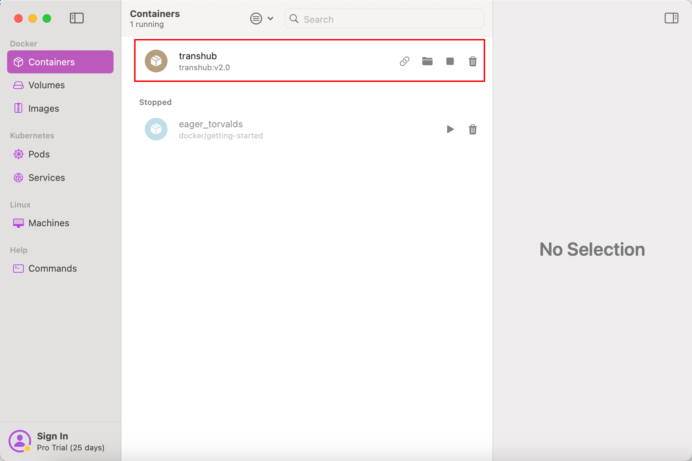

### 1.2.4. 进入 Transhub 容器

- 首先，确保容器已经启动并正在运行。在执行完 2.3 步后，容器已经处于运行状态。后续若需再次使用容器，则无需再重复执行 2.3
  步骤，可使用以下方法来启动容器。

> `docker run`命令通常用于第一次启动一个新的容器。当你执行 `docker run` 时，Docker 会执行两个步骤：首先，它会从指定的镜像创建一个新的容器（相当于执行了
`docker create` 命令），然后它会启动这个容器，使其变成一个运行中的容器（这一步相当于执行了 `docker start`命令）。因此，
`docker run` 是一个组合命令，它不仅创建容器，还会立即启动容器。如果在系统上找不到指定的镜像，`docker run` 甚至会尝试从
> Docker Hub 拉取镜像。
> 相比之下，`docker start` 命令用于启动一个已经存在的容器。如果你之前已经创建了一个容器（无论是通过 `docker create`
> 创建的，还是之前用 `docker run` 创建并启动过的），你可以使用 `docker start` 来重新启动这个容器。这意味着，使用
`docker start`
> 时，你必须知道要启动的容器的 ID 或名称。

可以运行以下命令查看容器状态：

```bash
docker ps
```

如果容器正在运行，你会看到类似以下的输出：

```bash
CONTAINER ID   IMAGE           COMMAND       CREATED       STATUS       PORTS     NAMES
eecfe24288b1   transhub:v2.0   "/bin/bash"   5 minutes ago Up 5 minutes          transhub
```

如果容器没有运行，可以使用以下命令启动它：

```bash
docker start transhub
```

- 使用 `docker exec` 命令进入容器的 Shell，后续即可在终端中**操作该容器**

```bash
docker exec -it transhub /bin/bash
```

- 接下来可进入容器的目录 `/home/none_root/transhub`，如果一切无误，你应该可以看到已安装好的 mahimahi 和 transhub 文件：

```bash
cd home/none_root/transhub/
ls
```

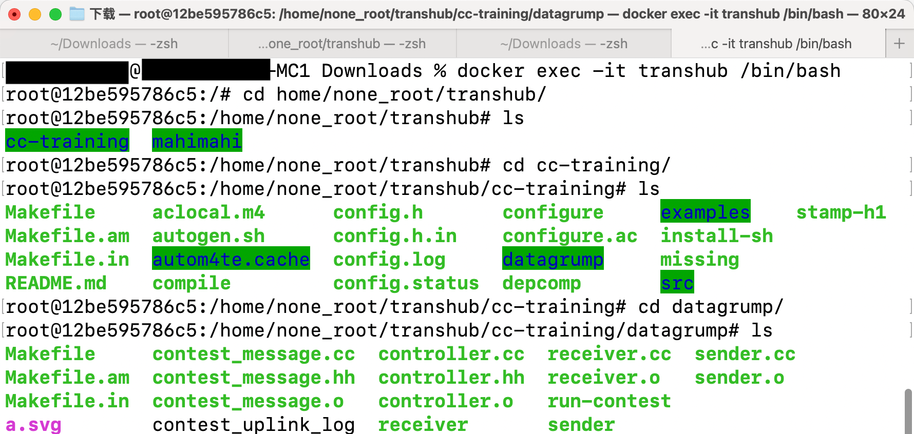

# （二）运行实验测试

运行 `run-contest`开始测试后，程序将模拟 VerizonLTE 连接大约两分钟，请耐心等待，运行完成时会生成日志。

💡`run-contest`工具负责将测试文件通过模拟 Verizon downlink 生成日志，并使用 mahimahi 仿真，提供传输过程中的性能信息，并显示
queueing delay 和 throughput 随时间变化的折线图。

### 2.1. 通过方式一安装的测试过程

- 运行 `run-contest`开始实验

```bash
sudo sysctl -w net.ipv4.ip_forward=1 #（必须启用Linux的IP转发才能使mahimahi工作）
cd datagrump #（前提已经在cc-training目录下）
./run-contest [scheme_name] #（scheme_name就是你给自己文件命名的名称，第一次使用时可以将[scheme_name] 替换为controller.cc）
```

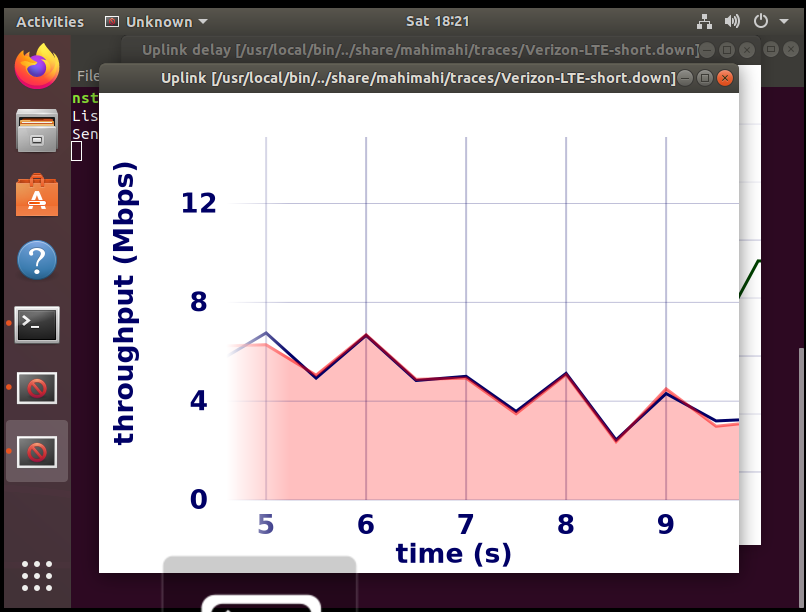

- 使用如下命令获取实验结果

```bash
mm-throughput-graph  500  ./contest_uplink_log > a.svg #（分析日志，输出吞吐等信息,得到svg图）

# 得到以下结果
Average capacity:平均容量
Average throughput:平均吞吐量
95(th) percentile per-packet queueing delay:95%排队延迟
95(th) percentile signal delay:95%信号延迟
```

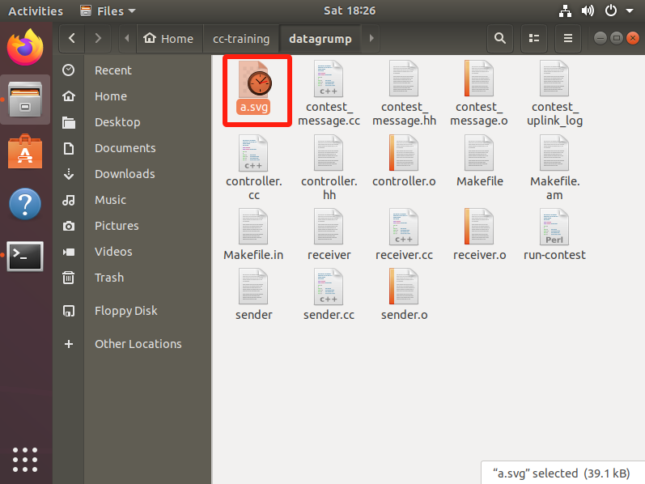


### 2.2. 通过方式二安装的测试过程

❗ 注意，在容器中运行时，运行 `run-contest`需要在非 root 用户下执行，而开启 linux 的 IP 转发以及编译源代码需要在 root 用户下。使用
`su none_root`切换为非 root 用户，使用 `exit`切换回 root 用户。在使用过程中请注意在两种用户间灵活切换。

- 运行 `run-contest`开始实验

```bash
sysctl -w net.ipv4.ip_forward=1 #（必须启用Linux的IP转发才能使mahimahi工作，此操作需在root用户下执行）
cd datagrump #（前提已经在cc-training目录下）
su none_root #（切换为非root用户。若是想再切换回root，只需要输入exit然后按下回车即可）
./run-contest [scheme_name] #（scheme_name就是你给自己文件命名的名称，第一次使用时可以将[scheme_name] 替换为controller.cc）
```

执行命令时，若如下方提示 `please run as non-root`，请使用命令 `su none_root`切换到 non_root 用户。

```bash
root@12be595786c5:/home/none_root/transhub/cc-training/datagrump# ./run-contest  controller.cc
Listening on :::9090
Died on std::runtime_error: mm-delay: please run as non-root

 done.
```

由非 root 用户切换回 root 用户示意图：


- 使用如下命令获取实验结果

```bash
mm-throughput-graph  500  ./contest_uplink_log > a.svg #（分析日志，输出吞吐等信息,得到svg图）

# 得到以下结果
Average capacity:平均容量
Average throughput:平均吞吐量
95(th) percentile per-packet queueing delay:95%排队延迟
95(th) percentile signal delay:95%信号延迟
```

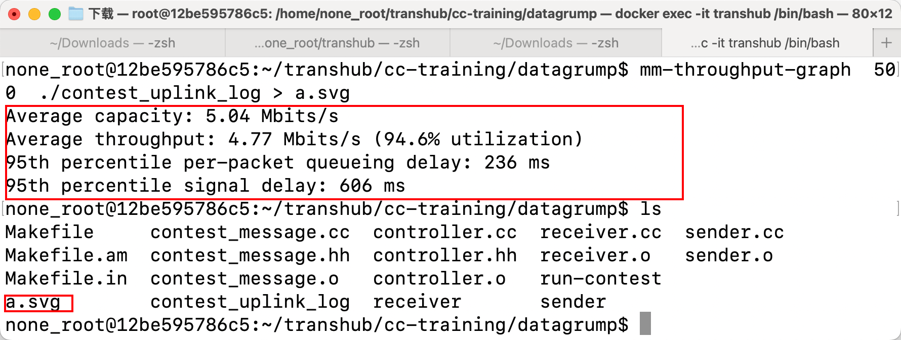

Mac 可通过以下方式找到容器内文件：


🎉**Congratulations！至此，你已成功安装 transhub，接下来请设计你的算法，并提交验证！**

# （三）进行算法开发

在 Ubuntu 内安装 vscode 或在宿主机使用 vscode
远程连接到虚拟机（连接方法可查看教程[让 Visual studio code 使用 SSH 连接虚拟机 Ubuntu 开发](https://zhuanlan.zhihu.com/p/681363165)
或搜索关键词 `vscode连接虚拟机`）。

打开代码目录，修改 `controlle.cc`代码，修改完成后，执行 `make`命令编译代码，然后运行测试验证代码效果即可。

如果是使用docker方式安装，由于docker镜像系统版本较低，无法使用最新vscode进行远程连接（弹出如下提示），可以通过目录映射将docker容器内目录映射到宿主机上进行开发。

对于 Mac 用户，Orbstack默认进行了目录挂载，可在vscode中直接打开目录 `~/OrbStack/docker/containers/transhub/home/none_root`

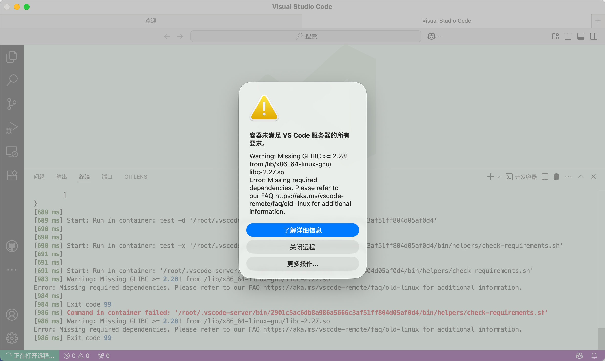

# （四）系统拥塞控制算法配置（可选）

本节内容介绍了如何查看并修改系统拥塞控制算法，属于**拓展阅读**部分。

Linux 系统中可选的拥塞控制算法包括 `reno`、`cubic`、`bbr`等。本节以配置 `bbr`算法为例：

❗ 配置不同的拥塞控制算法会对传输结果产生不同的影响，可做相关实验验证（此处所指**实验并非**本 transhub 中的 `run-contest`
实验，`run-contest`的拥塞控制算法为 `controller.cc`,与系统拥塞控制算法无关。如需验证系统拥塞控制算法，可使用 `iperf`
等工具来做相关实验）。

### 4.1. 通过方式一安装的操作过程

💡 在 Linux 主机上启用 BBR 算法

```bash
# 查看系统支持的拥塞控制算法
sudo sysctl net.ipv4.tcp_available_congestion_control
# 输出结果：表明当前系统支持reno cubic算法
# net.ipv4.tcp_available_congestion_control = reno cubic

# 查看系统当前使用的拥塞控制算法
sudo sysctl net.ipv4.tcp_congestion_control
# 输出结果：表明当前系统使用cubic算法
# net.ipv4.tcp_congestion_control = cubic

# 切换到BBR
sudo sysctl net.core.default_qdisc=fq
sudo sysctl net.ipv4.tcp_congestion_control=bbr
# 查看是否切换成功
sudo sysctl net.ipv4.tcp_congestion_control

# 切换回CUBIC
sudo sysctl net.core.default_qdisc=pfifo
sudo sysctl net.ipv4.tcp_congestion_control=cubic
# 查看是否切换成功
sudo sysctl net.ipv4.tcp_congestion_control
```

### 4.2. 通过方式二安装的操作过程

💡 在 Docker 容器中启用 BBR 算法

**附相关知识点：Docker 容器共享主机内核**：

- Docker 容器共享宿主机的内核，因此容器内的网络配置（如拥塞控制算法）受宿主机内核限制。
- 如果宿主机内核不支持 BBR，容器内也无法使用 BBR。

> [Docker](https://zhida.zhihu.com/search?content_id=461284401&content_type=Answer&match_order=1&q=Docker&zhida_source=entity)
> 在[macOS](https://zhida.zhihu.com/search?content_id=461284401&content_type=Answer&match_order=1&q=macOS&zhida_source=entity)
> 上和Windows上跑[Linux](https://zhida.zhihu.com/search?content_id=461284401&content_type=Answer&match_order=1&q=Linux&zhida_source=entity)
> docker都是先套了个虚拟机，虚拟机里跑Linux提供[kernel](https://zhida.zhihu.com/search?content_id=461284401&content_type=Answer&match_order=1&q=kernel&zhida_source=entity)
> ，再在里面跑docker。目前虚拟机在Windows上是[Hyper-V](https://zhida.zhihu.com/search?content_id=461284401&content_type=Answer&match_order=1&q=Hyper-V&zhida_source=entity)
> 或者WSL，macOS上有两套方案。

**拥塞控制算法**属于**内核算法**，所以在 Docker 容器能够使用的拥塞控制算法受**宿主机内核**确定。bbr
算法是较新的算法，并非在所有内核都支持。

使用命令 `sysctl net.ipv4.tcp_available_congestion_control`查看当前支持的拥塞控制算法：

```bash
# 查看系统支持的拥塞控制算法
sysctl net.ipv4.tcp_available_congestion_control
# 输出结果：表明当前系统支持reno cubic算法
# net.ipv4.tcp_available_congestion_control = reno cubic
```

- 如是 Linux 宿主机，可按照 3.1 节方法开启宿主机 bbr 算法，在容器中也将变更为 bbr 算法。
- Mac 若是使用 Orbstack 的容器，可尝试使用 reno 或 cubic 算法。目前暂时没找到打开 bbr 的方法，因为容器内开启 bbr 算法需要
  **宿主机内核**支持。而在 Orbstack 中，该内核实际上是由 Orbstack 提供的**定制化的内置 Linux 内核**，用户无法修改。
- Windows Docker 若是使用 WSL 后端，暂时不支持该操作。

在 Docker 中切换拥塞控制算法的命令如下：

```bash
# 查看系统支持的拥塞控制算法
sysctl net.ipv4.tcp_available_congestion_control
# 输出结果：表明当前系统支持reno cubic算法
# net.ipv4.tcp_available_congestion_control = reno cubic

# 查看系统当前使用的拥塞控制算法
sysctl net.ipv4.tcp_congestion_control
# 输出结果：表明当前系统使用cubic算法
# net.ipv4.tcp_congestion_control = cubic

#===========若内核支持BBR，使用以下命令切换到BBR以及切回CUBIC
# 切换到BBR
sysctl net.core.default_qdisc=fq
sysctl net.ipv4.tcp_congestion_control=bbr
# 查看是否切换成功
sysctl net.ipv4.tcp_congestion_control

# 切换回CUBIC
sudo sysctl net.core.default_qdisc=pfifo
sudo sysctl net.ipv4.tcp_congestion_control=cubic
# 查看是否切换成功
sudo sysctl net.ipv4.tcp_congestion_control

#===========若内核不支持BBR，例如使用Orbstack，使用以下命令切换到RENO以及切回CUBIC
# 切换到RENO
sysctl net.ipv4.tcp_congestion_control=reno

# 切换到CUBIC
sysctl net.ipv4.tcp_congestion_control=cubic
```

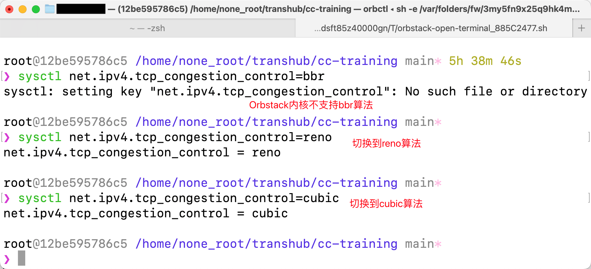

# （五）常见问题

### 5.1. Ubuntu24 版本默认安装 gnuplot 6.0 导致无法正确绘制流量图

对于 Ubuntu 24 版本，可能默认安装的 gnuplot 为 6.0 版本，将导致后续绘制流量图时出错（绘制的流量图无法正常打开），需要将
gnuplot 降级到 5.4，Ubuntu 22 及以下版本默认安装的是 5.4 版本，不会有此问题。

使用以下命令降级到 5.4 版本

   ```sh
   # 1. 卸载当前版本
   sudo apt remove --purge gnuplot

   # 2. 安装编译依赖
   sudo apt update
   sudo apt install build-essential libx11-dev libxt-dev libcairo2-dev libpango1.0-dev

   # 3. 下载5.4.0源码包
   wget https://sourceforge.net/projects/gnuplot/files/gnuplot/5.4.0/gnuplot-5.4.0.tar.gz
   tar xvf gnuplot-5.4.0.tar.gz
   cd gnuplot-5.4.0

   # 4. 编译安装
   ./configure --prefix=/usr/local
   make -j$(nproc)
   sudo make install

   # 5. 创建符号链接
   sudo ln -sf /usr/local/bin/gnuplot /usr/bin/gnuplot

   # 6. 验证版本
   gnuplot --version
   ```

### 5.2. Ubuntu20 版本由于防火墙导致无法运行实验

Ubuntu20、22 版本也可正常完成 transhub 安装，但在运行实验时，需要关闭防火墙，否则实验跑不通。使用以下命令关闭防火墙：

   ```shell
   sudo ufw disable
   ```

### 5.3. WSL 无法正常安装 transhub

根据实测，使用 Windows WSL 无法成功安装 transhub，因此不建议使用 WSL Docker。对于 Windows 用户，同学们可使用 Linux
虚拟机直接安装 transhub 或者在 Linux 虚拟机中使用 Docker。

### 5.4. 丢包环境下 mm-throughput-graph 无法绘制

需要修改 `/usr/local/bin/mm-throughput-graph`⽂件使得该脚本能对有丢包事件的⽇志进⾏画图操作，具体改动如下图所⽰（改动之处⽤红框标出）
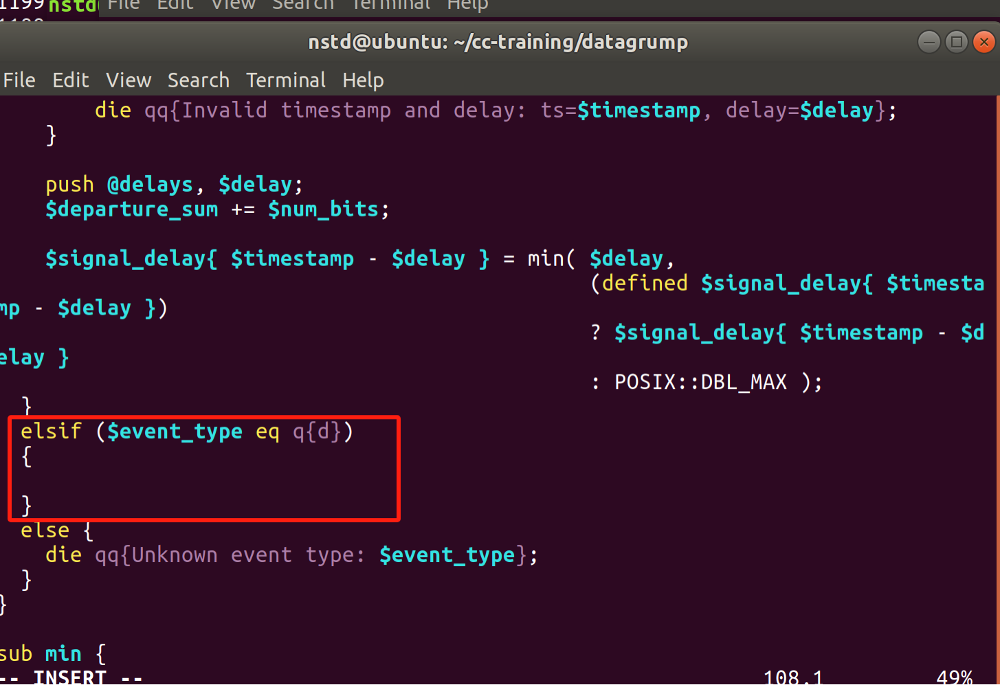

本文档更新时间：2025 年 07 月 11 日 星期五
