# Transhub竞赛指南

本次竞赛最终结果需要提交在本网站 “算法提交” 处并查看排名。但为了方便参赛者修改和调试自己的拥塞控制算法代码，需要各位在本地配置
Transhub 运行环境，可阅读本文“Transhub 代码框架”和 “安装指南” 部分。

本次比赛设置一二三等奖及优胜奖，并设立奖金，欢迎同学们积极参与！

**赛事简介：**
计算机网络赛道旨在考察参赛者对计算机网络协议特别是拥塞控制算法的理解程度，让同学们能够更深入地了解和掌握计算机网络协议的原理和实现，提升网络编程能力，为上层大数据、人工智能、分布式系统等相关应用的开发打下坚实的基础。
本次竞赛为个人赛，将提供一个用户态协议框架Transhub（开放源码，可本地部署和调试），该框架基于UDP协议进行实现，提供传输协议基本的功能模块，如序号、包类型、确认机制等，并提供如发送、接收等预制的接口API。参赛者需要在该框架上，以“完形填空”的形式实现一个拥塞控制算法。比赛形式为排行榜形式，参赛者将自己的算法源码上传至线上Transhub平台。线上Transhub平台提供统一的benchmark对参赛者的算法进行测试。具体地，通过模拟不同的网络环境，针对时延、吞吐和丢包三个指标，对参赛者提供的拥塞控制算法进行评估，并打出综合评分，评分越高，最终排名越靠前。在打榜开放之日起，参赛者可随时不限次数地上传自己的算法，榜单将更新参赛者的历史最高成绩。比赛结束后，将对榜单成绩进行复核，并按照最终复核排名决出相应奖项（优胜奖综合考虑排名和算法设计）。


## 1. 评分标准

### 1.1 指标定义与数据来源

| 指标名称             | 变量名                 | 描述                         |
| -------------------- | ---------------------- | ---------------------------- |
| 吞吐量               | `throughput`           | 平均吞吐量                   |
| 链路带宽             | `capacity`             | 平均链路带宽                 |
| 带宽利用率           | `capacity_utilization` | 吞吐量与链路带宽的比值       |
| 排队时延     | `queueing_delay`       | 下行链路所有数据包排队时延的95分位点 |
| 单向传播时延 | `one-way_propagation_delay`        | 下行链路单向传播时延（不包含排队时延） |
| 延迟膨胀率           | `delay_inflation`      | 排队延迟与基础单向延迟的比值 |
| 总丢包数             | `total_lost`           | 丢失的数据包总量             |
| 总发包数             | `total_sent`           | 发送的数据包总量             |
| 丢包率               | `loss_rate`            | 总丢包数与总发包数的比值     |

### 1.2 评分维度与权重

| 评分维度名称     | 变量名             | 权重 | 评分范围 |
| ---------------- | ------------------ | ---- | -------- |
| **带宽利用得分** | `throughput_score` | 35%  | 0-100    |
| **延迟控制得分** | `delay_score`      | 35%  | 0-100    |
| **丢包控制得分** | `loss_score`       | 30%  | 0-100    |
| **总得分**       | `total_score`      | 100% | 0-100    |

### 1.3 详细评分规则

#### 1.3.1. 带宽利用得分 (35%)

$$
\text{capacity\_utilization} = \frac{\text{throughput}}{\text{capacity}}
$$

$$
\text{throughput\_score} = 100 \times \text{capacity\_utilization}
$$

#### 1.3.2. 延迟控制得分 (35%)

$$
\text{delay\_inflation} = \frac{\text{queueing\_delay}}{\text{one-way\_propagation\_delay}}
$$

$$
\text{delay\_score} =
\begin{cases}
20 + 80 \times \dfrac{10 - \text{delay\_inflation}}{10} & \text{if } \text{delay\_inflation} \leq 10 \\\\
\dfrac{200}{\text{delay\_inflation}} & \text{if } \text{delay\_inflation} > 10
\end{cases}
$$

延迟得分曲线如下图所示：
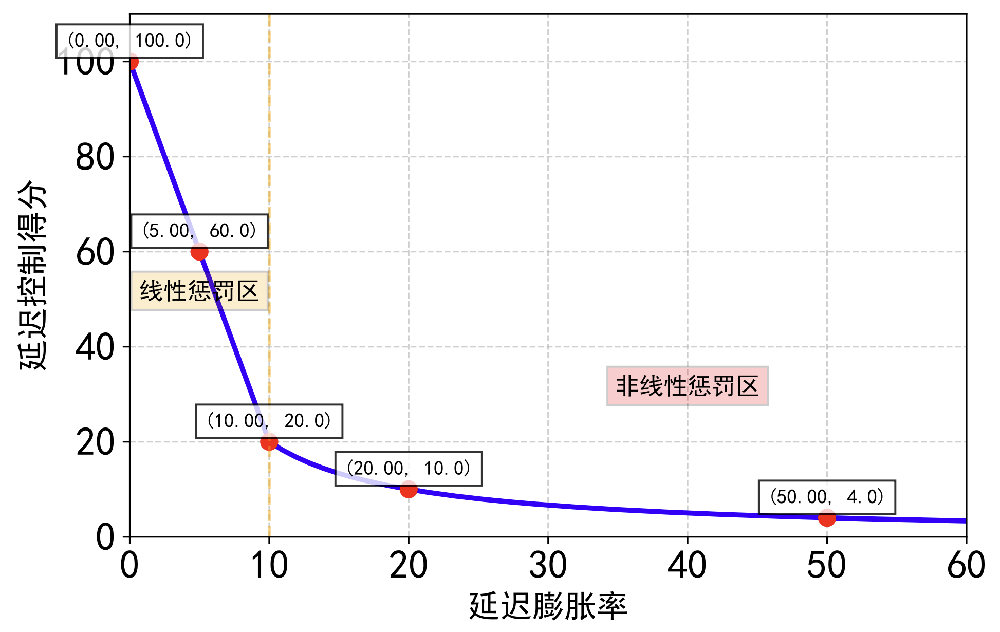

#### 1.3.3. 丢包控制得分 (30%)

$$
\text{loss\_rate} = \frac{\text{total\_lost}}{\text{total\_sent}}
$$

$$
\text{loss\_score} = 100 \times (1 - \text{loss\_rate})
$$

#### 1.3.4. 总得分

$$
\text{total\_score} = 0.35 \times \text{throughput\_score} + 0.35 \times \text{delay\_score} + 0.30 \times \text{loss\_score}
$$


## 2. 测试用例

本次比赛总共包含10类测试用例，以评价不同场景下的算法性能，以下是测试用例介绍：

| 测试用例           | 特点                                                         | 算法目标                                                     | 真实场景                                                     |
| :----------------- | :----------------------------------------------------------- | :----------------------------------------------------------- | :----------------------------------------------------------- |
| 移动网络1（公开）  | 带宽动态且频繁地波动。                                       | 快速、准确地测量实时带宽，在保证低时延和低丢包率的同时，最大化吞吐量。 | 用户在公交、地铁、汽车等移动交通工具上使用网络，信号强度和网络负载不断变化。 |
| 强弱网切换（公开） | 带宽在短时间内从高带宽（强网）突降至低带宽（弱网），或反之。 | 快速响应带宽剧变，在切换到弱网时能迅速降低发送速率以避免拥塞，在切换到强网时能快速提升速率以利用可用带宽。 | 用户从室内Wi-Fi环境走到室外使用4G/5G网络，或进入/离开电梯、隧道等信号屏蔽区域。 |
| 移动网络2          | 带宽动态且频繁地波动。                                       | 快速、准确地测量实时带宽，在保证低时延和低丢包率的同时，最大化吞吐量。 | 用户在公交、地铁、汽车等移动交通工具上使用网络，信号强度和网络负载不断变化。 |
| 带宽突变           | 网络可用带宽发生非连续的大幅度增加或减少。                   | 能够适应较大的带宽变化范围，具有良好的上探和收敛性能，避免在带宽下降时产生大量丢包，在带宽上升时能快速跟进。 | 在共享网络（如办公室、家庭Wi-Fi）中，其他用户开启或停止大流量任务（如下载、视频流）。 |
| 长肥网络 (LFN)     | 具有非常大的带宽时延积（BDP），即高带宽和高往返时延（RTT）并存。 | 能够快速将发送窗口提升至BDP大小，充分利用链路容量，实现高带宽利用率，同时避免因窗口过大导致拥塞。 | 跨国或跨洲际的数据传输、卫星通信等场景。                     |
| 低时延网络         | 往返时延（RTT）非常低，通常小于30ms。                        | 维持极低的排队延迟，对延迟变化极其敏感，避免不必要的速率波动，保证交互的实时性。 | 数据中心内部通信、局域网内的实时游戏、远程桌面等。           |
| 高时延网络         | 往返时延（RTT）非常高，通常大于200ms。                       | 在高延迟反馈下保持稳定，避免因反馈滞后而导致的发送速率剧烈震荡和拥塞崩溃。 | 卫星网络通信、国际长途视频会议、在地理位置偏远的地区访问中心服务器。 |
| 随机丢包           | 链路中存在不因拥塞导致的随机数据包丢失。                     | 准确区分拥塞丢包和随机丢包，避免因随机丢包而错误地大幅降低发送速率，维持稳定的吞吐。 | 无线信道（Wi-Fi, 4G/5G）受到干扰、有线链路质量差等情况；跨省等场景下由于运营商策略导致的随机丢包。 |
| 浅缓冲区           | 网络路径中的路由器或交换机缓冲区（Buffer）非常小。           | 精确控制数据发送量，避免瞬间流量超出缓冲区容量导致大量丢包，对排队延迟的增长做出快速反应。 | 一些低成本的家用路由器或特定网络设备，为了降低成本和延迟而配置了较小的缓冲区。 |
| 深缓冲区           | 网络路径中的路由器或交换机缓冲区非常大。                     | 避免过度填充缓冲区导致的高排队延迟（Bufferbloat），在维持高吞吐的同时，将网络延迟控制在较低水平。 | 许多现代网络设备为了防止突发流量下的丢包而配置了过大的缓冲区，容易引发延迟剧增问题。 |

**注：上述表格顺序与任务详情页面显示的评测用例顺序并非一一对应关系。*

## 3. 成绩复核办法

比赛结束后，将对榜单中的代码进行复测及人工复核。

人工复核：检查代码是否存在抄袭等问题，存在问题的代码成绩无效。对于算法中存在根据评测用例采用类似“打表”的代码（例如以下伪代码示例），将对奖项进行降等处理（例如：一等奖->二等奖，三等奖->优胜奖）。

```c
// 公开测试用例
if (time < 18s)
  bandwidth = 35mbps;
else if (time < 38s)
  bandwidth = 12mbps;
else
  bandwidth = 35mbps;

window_size = f(bandwidth);
```

系统复测：对每份代码提交三次。复测时，将评测任务并发数设置为1，并关闭性能图绘制功能，避免评测间相互干扰。

最终成绩：根据系统复测结果，取三次复测的平均分作为最终成绩。复测过程中，如因系统原因导致成绩异常的，将再次提交，不影响分数；如是算法设计缺陷导致的分数异常（例如：部分代码在测试过程中有概率出现以下如图所示问题，此问题属于算法缺陷），也将再次提交，但对应复测分数-5分。

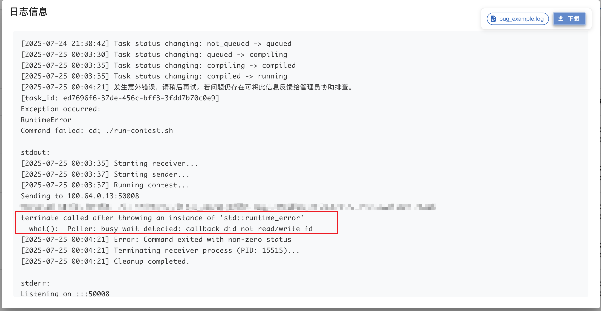

## 4. 评奖标准

- 一二三等奖：按照复测后的排名顺序，分配奖项。
- 优胜奖：综合考虑排名和算法设计，因此建议在代码中使用注释介绍自己的算法设计思想、亮点等（如下图所示），便于后续评阅。

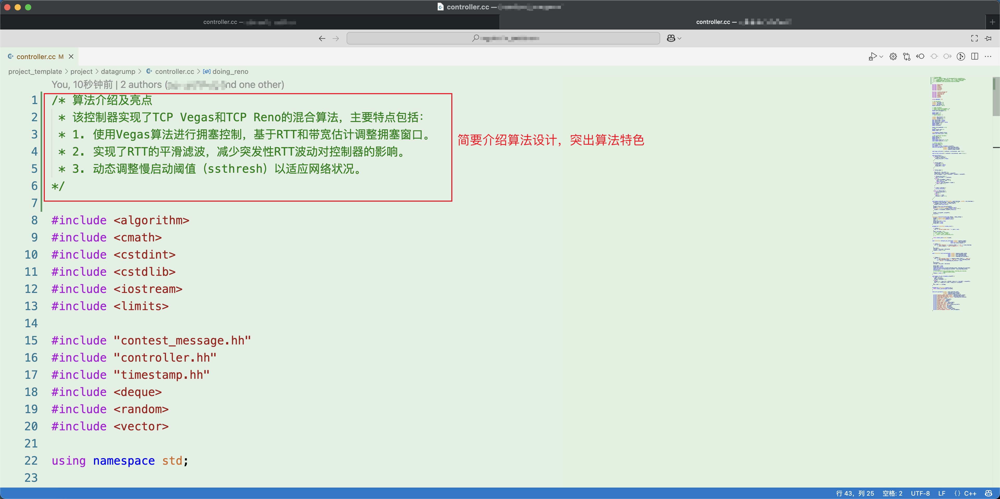

## 5. 奖项设置

| 名称   | 比例 | 奖金/证书        |
| ------ | ---- | ---------------- |
| 一等奖 | 2%   | 3000元、获奖证书 |
| 二等奖 | 4%   | 1500元、获奖证书 |
| 三等奖 | 6%   | 1000元、获奖证书 |
| 优胜奖 | 20%  | 获奖证书         |

## 6.学术诚信

1. 参赛者应自觉遵守知识产权和各种开源协议的有关法规和规定，不得侵犯他人的知识产权或其他权益。如造成不良后果，相关法律责任由参赛者自行承担。

2. 参赛者必须严守学术诚信，一经发现恶意代码或技术抄袭等学术不端行为，经比赛委员会组织的匿名评议确认后，取消参赛者的参赛资格。对于已经获得奖项的参赛者，取消和追回已获得的证书和奖金。


# 竞赛平台使用提示

## 1. 代码上传

- 代码上传的并发数量具有限制，当处于运行或队列中的提交数量超过限制后，将不允许再继续上传，需等待其运行完毕后，才可继续上传。

- 在上传时，可以选择要评测的测试用例。较少的用例可以缩短评测时间，在开发初期建议只选择公开用例进行评测，如果算法在特定用例上表现不佳，可以对其进行针对性优化，并只评测对应用例。注意，代码完善后，应当运行所有评测用例，只有评测完所有用例才计为**有效成绩**用于更新榜单。

- 即使上传时未勾选所有用例，后续仍可在历史记录页面找到对应提交，打开任务详情并手动执行未评测用例。

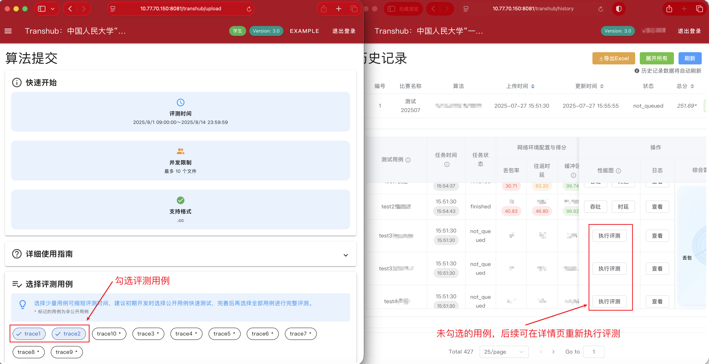

## 2. 查看雷达图

在“综合雷达图”表头右侧，点击按钮显示所有用例雷达图，可快速比较不同用例上的表现。

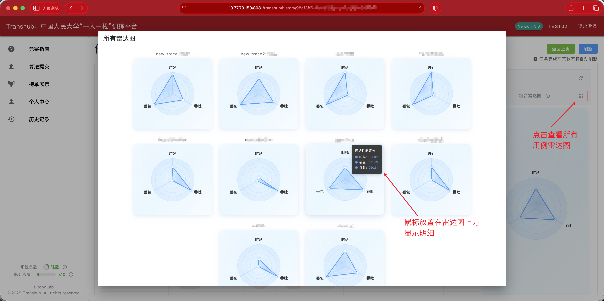

## 3. 使用日志调试算法

对于未公开的评测用例，可以通过在代码中添加日志打印来分析算法在不同用例中的运行情况，并为算法优化提供参考。

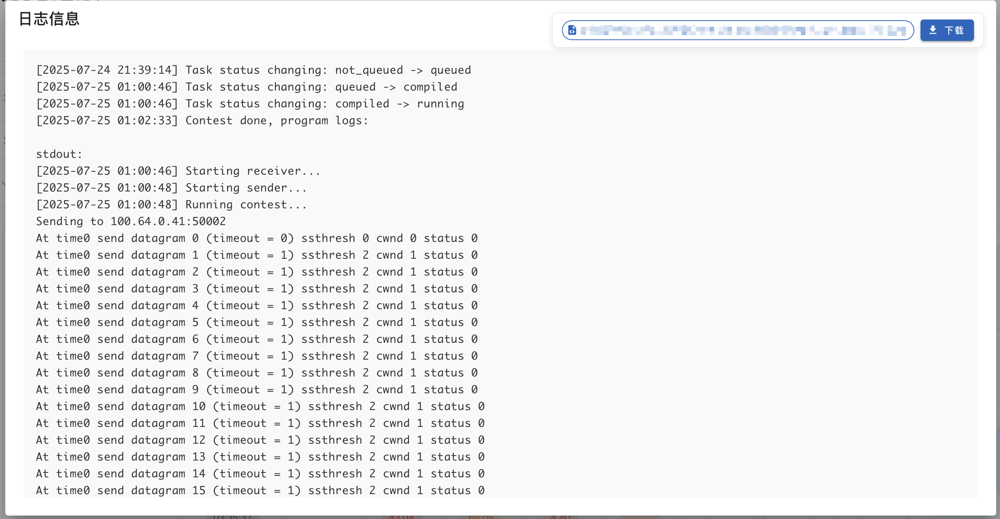

## 4. 榜单记录删除

系统提供榜单记录删除功能。由于榜单显示的是历史最高分对应的提交，如果后续想要替换榜单中的代码，不一定保证新提交的代码分数一定会更高，故提供此功能。需注意此功能存在使用限制（例如删除频率，功能开放时间），请合理使用。此功能建议在以下场景下使用：

- 最终算法已完成，但是忘记在代码中添加注释介绍算法（在本文“评奖标准”处，我们**建议**在代码中添加此内容，便于后续评阅）。
- 代码存在偶现bug，但是某次提交时没有触发bug，并更新了榜单。可以在修复后，删除榜单记录重新提交。

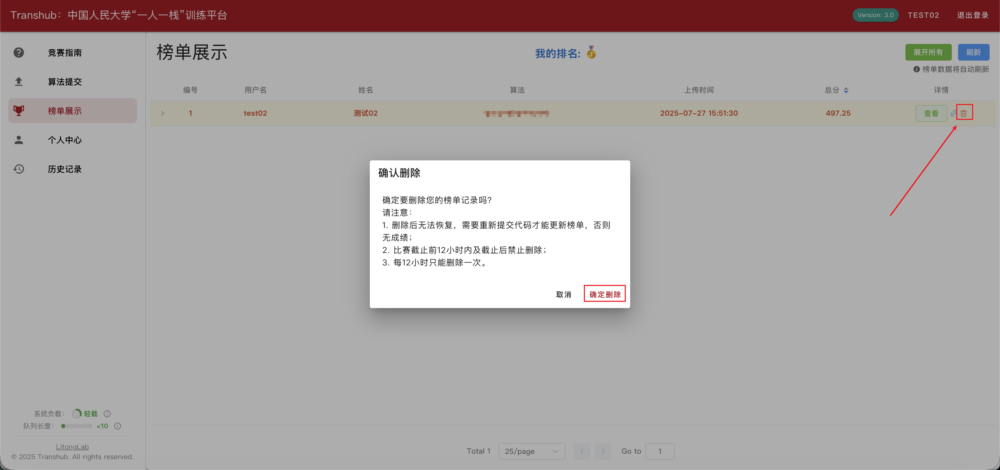

## 5. 截止提交时间

超过比赛截止时间后，将不再允许代码提交，已提交的代码仍将继续排队运行并更新榜单。


# Transhub 框架介绍

将 Transhub 代码克隆到本地后，大家需要关心 `/cc-training/datagrump` 目录下的内容，该目录下的内容与比赛息息相关，以下是对
`datagrump` 目录下各文件的简单介绍。

- **contest_message 文件**：规定数据报文的格式。

  在通信之前，我们需要事先在通信双方约定一个通信语法，也就是对应着一个报文格式标准，用来指定传输过程中数据的组织形式。报文格式标准没有固定的要求，唯一的要求就是发送端和接收端都接受相同的标准。

  数据报文（Packet）总体来说分为两个部分：报文头部和包内数据。报文头部主要包含描述报文特性的一些元数据，例如报文序列号、报文的发送时间等等。比赛测试场景是固定发送端和接收端，因此报文头元数据部分更加简单，具体有以下一些字段：

  `sequence_number`：数据报文的序列号

  `send_timestamp`：数据报文的发送时间

  `ack_sequence_number`：确认收到的数据报文序列号

  `ack_send_timestamp`：确认报文（ACK）的发送时间

  `ack_recv_timestamp`：确认报文（ACK）的接收时间

  `ack_payload_length`：数据报文的有效载荷大小

- **sender.cc 文件**：模拟发送端的行为。

  发送端的行为遵循两个准则，一是如果发送端还有发送窗口空余，发送端就发送更多的数据报文来填满发送窗口；二是如果发送端收到了
  ACK，处理该确认报文并通知 `controller`，进行拥塞控制。此外，如果超过了一定的时间（超时时间）发送端还没收到
  ACK，发送端会认为这个报文丢失了，会进行重传。具体细节请参看 `sender.cc` 文件。

- **receiver.cc 文件**：模拟接收端的行为。

  接收端会为收到的每个数据报文发送 ACK，`ack_sequence_number` 就是数据报文的序列号 `sequence_number`，具体细节请参看
  `receiver.cc` 文件和 `contest_message.cc` 文件中的 `transform_into_ack` 函数。

- **controller.cc 文件**：模拟进行拥塞控制的文件，也是参赛者们需要修改的文件。 有以下四个接口函数：

  `window_size()`：返回给发送端当前的发送窗口大小。

  `datagram_was_sent()`：发送端发送数据报文时调用 controller 中的该函数，参数中有 `const bool after_timeout`
  标志位，标记该报文是否是因为超时发送的。

  `ack_received()`：发送端收到 ACK 时会调用 controller 中的该函数，根据 ACK 报文中的信息，如确认序列号、数据报文的发送时间戳、ACK
  的接收时间戳等信息，计算往返时延等变量，进行拥塞控制。

  `timeout_ms()`：设置超时时间，返回给发送端。

- **run-contest 文件**：测试脚本。


# Transhub 安装指南 2026 版

硬件环境：一台 Linux 主机（在本文中，Linux 主机包括运行 Linux 系统的实体机、虚拟机或云服务器）

Linux 版本要求：Ubuntu GNU/Linux 14.04 以上

**拥塞控制算法的运行示意图如下：**

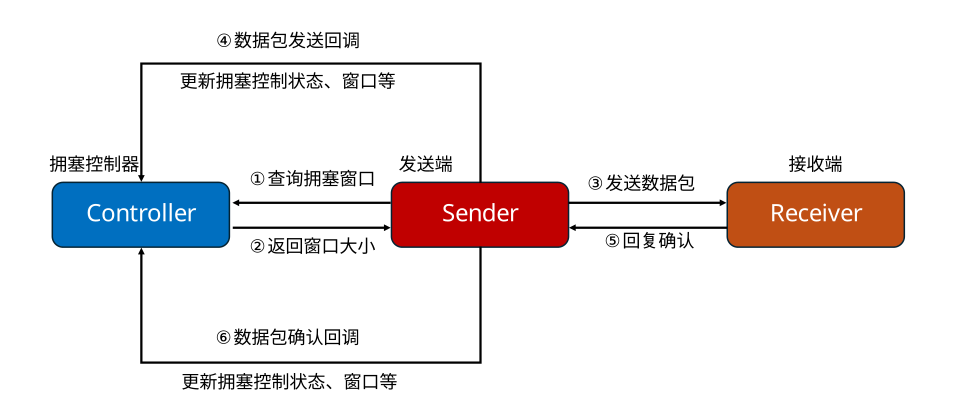

本教程提供两种安装方式，两种方式**任选其一**：

- 第一种方法为使用 Linux 虚拟机/主机，安装相关依赖，下载 transhub 代码并编译，编译完成后即可运行实验。
- 第二种方法为使用已配置好的 Docker 镜像，镜像里已装好相关依赖和代码，**开箱即用**，可**直接**运行实验。

❗ 由于以上部分依赖仅有 x86 架构的包，因此使用**Mac M 芯片**的同学需要注意，如果使用第一种方法自行安装虚拟机，需安装
x86 架构的 Linux 系统，使用 Arm 架构的虚拟机将无法安装所有依赖。建议 Mac M 芯片同学使用**Docker 方法**。

❗ 高版本 Ubuntu、WSL 存在已知问题，详情请参阅常见问题章节。

## 1. 安装 transhub

### 1.1. 方式一：使用 Linux 虚拟机/主机直接安装 transhub

> ⭐**Windows 系统推荐使用此方式**

#### 1.1.1 安装 Linux 虚拟机（若直接使用 Linux 物理机可跳过此步）

- 下载 VMware 软件

参考教程：

[VMware Workstation Pro 17 官网下载安装教程\_vmware17pro 下载-CSDN 博客](https://blog.csdn.net/air__j/article/details/142798842)

官方下载链接：

[https://support.broadcom.com/group/ecx/productdownloads?subfamily=VMware%20Workstation%20Pro](https://support.broadcom.com/group/ecx/productdownloads?subfamily=VMware%20Workstation%20Pro)

~~⭐**官方所有版本下载链接（推荐，官方渠道且无需注册账户可直接下载）：**~~

~~[https://softwareupdate.vmware.com/cds/vmw-desktop/ws/](https://softwareupdate.vmware.com/cds/vmw-desktop/ws/)~~

上述链接已失效，可访问以下链接下载：

[https://github.com/yanghao5/VM-download](https://github.com/yanghao5/VM-download)

例如选择 17.6.2 版本：

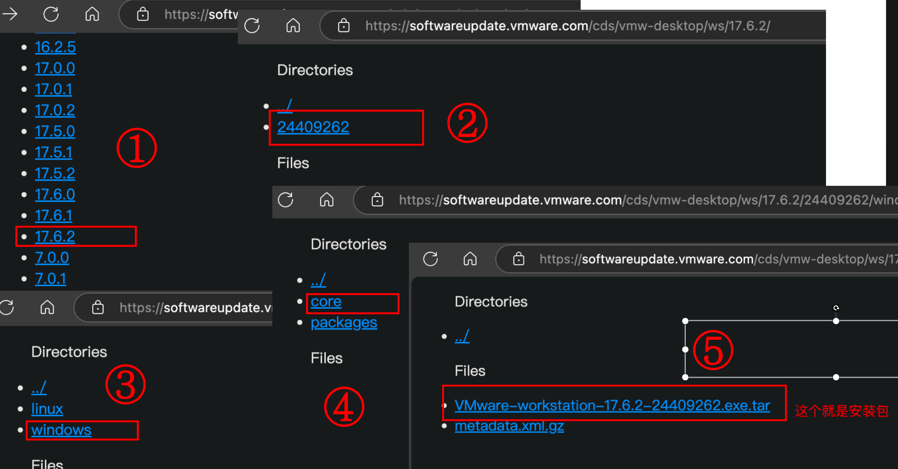

- 下载 Ubuntu 镜像（Ubuntu18 或 20、22 等版本，可根据自身需求选择。由于 vscode 限制，较老的系统版本无法使用 vscode 进行 ssh
  远程连接）

[Index of /ubuntu-releases/18.04/ | 清华大学开源软件镜像站 | Tsinghua Open Source Mirror](https://mirrors.tuna.tsinghua.edu.cn/ubuntu-releases/18.04/)

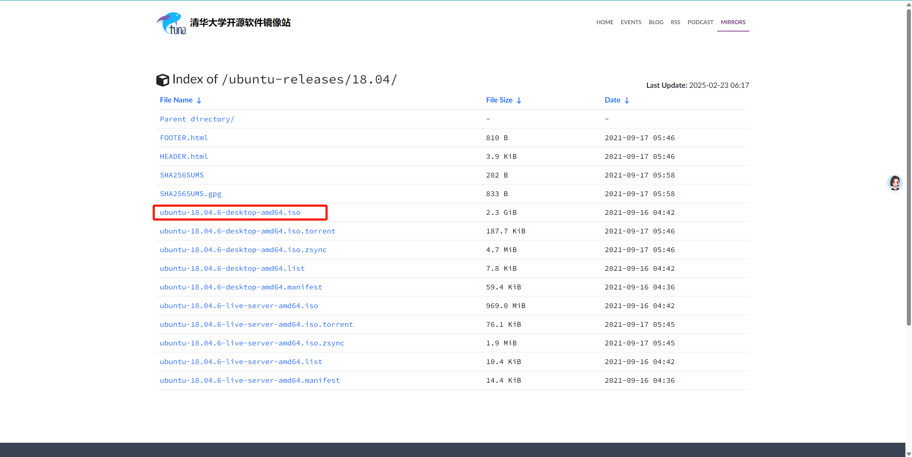

- 使用 VMware 创建 Ubuntu 虚拟机

#### 1.1.2. 安装 Mahimahi

- 在其终端中运行如下代码，安装依赖项：

```bash
sudo apt-get install build-essential git debhelper autotools-dev dh-autoreconf iptables protobuf-compiler libprotobuf-dev pkg-config libssl-dev dnsmasq-base ssl-cert libxcb-present-dev libcairo2-dev libpango1.0-dev iproute2 apache2-dev apache2-bin iptables dnsmasq-base gnuplot iproute2 apache2-api-20120211 libwww-perl
```

（这些依赖项在[mahimahi / debian / control](https://github.com/keithw/mahimahi/blob/master/debian/control#L5)
中列出，另外还有一些用于比赛的依赖项）

- 下载 mahimahi 源代码

```bash
git clone https://github.com/ravinet/mahimahi
```

（Mahimahi 工具提供了我们模拟的蜂窝网络和测量工具）

- 编译并安装 mahimahi

```bash
cd mahimahi

# （用make工具编译mahimahi）
./autogen.sh && ./configure && make

# 安装
sudo make install
sudo sysctl -w net.ipv4.ip_forward=1
# 进入mahimahi
mm-delay 20
# 退出mahimahi
exit
```

（若要检查是否安装成功，可运行 `mm_delay 20`，若出现 delay 20ms 字样，说明安装成功）

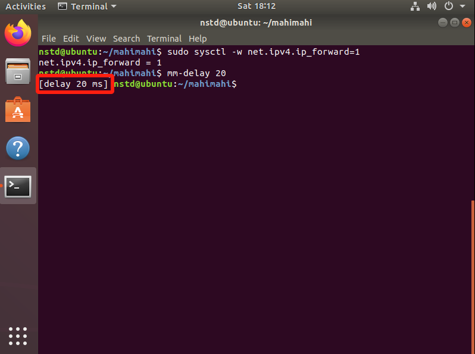

#### 1.1.3. 编译 Transhub 代码

```bash
#退出mahimahi目录，回到用户目录
cd ..
#下载transhub代码
git clone https://github.com/litonglab/transhub_local_env.git
cd transhub_local_env
#按常规方式编译代码
./autogen.sh && ./configure && make
```

### 1.2. 方式二：使用已安装好 Transhub 的 Docker 镜像

> ⭐**MacOS 系统推荐使用此方式**

> 1.2.1 部分仅限 Mac，Linux/Windows 平台参照对应教程安装好 Docker 后，后续方法（1.2.2-1.2.4）通用。

#### 1.2.1. 安装 Docker

Linux 上如何安装使用 Docker 请自行查询相关教程，此处以 Mac 安装 Docker 为例。

❗️ 实测 Windows 使用 Docker 无法正常运行实验，请查看常见问题章节。

Mac 上可安装 Docker Desktop 或者 Orbstack，这里以 Orbstack 为例。

> OrbStack 是一款专为 MacOS 设计的轻量级容器和虚拟机管理工具，旨在为开发者提供快速、高效的容器化开发和测试环境。它支持
> Docker 容器和 Linux 虚拟机，特别针对 Apple Silicon（M1/M2 等 ARM 芯片）进行了优化，能够无缝运行 x86 和 ARM 架构的容器。

访问[https://orbstack.dev/download](https://orbstack.dev/download)下载并安装。安装好后，打开 Orbstack 完成初始化。

#### 1.2.2. 下载并**导入 Transhub 镜像**

访问以下链接下载已配置好的 transhub 镜像：

- 百度网盘：通过网盘分享的文件：transhub.tar.zip
  链接: [https://pan.baidu.com/s/1Lkx7VVvNTCAVaBJozT-8Lg?pwd=wnxf](https://pan.baidu.com/s/1Lkx7VVvNTCAVaBJozT-8Lg?pwd=wnxf)
  提取码: wnxf

在**镜像所在目录**运行终端，执行以下命令导入 transhub 镜像

```bash
docker load -i transhub.tar
```

导入成功后，可以在 Orbstack 看到该镜像：

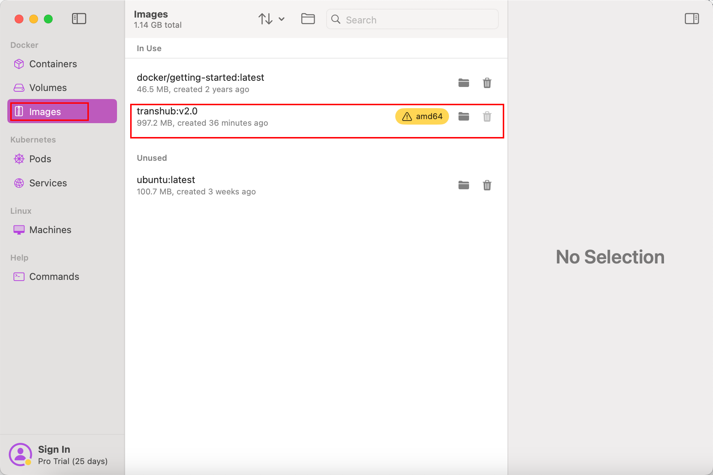

#### 1.2.3. 创建并运行 Transhub 容器

此步骤**仅需执行一次**，使用以下命令创建并运行 transhub 容器：

```bash
sudo docker run --platform linux/amd64 --privileged -itd --name transhub transhub:v2.0
```

❗ 注意，在 m 芯片 mac 上，需要显式指定平台为 `linux/amd64`，强制运行 x86 架构的镜像

❗ 注意，如需要使用 `-v`命令将主机上的目录挂载到容器目录，请勿覆盖容器内的 `/home/none_root/transhub`
目录。因为该目录下已包含配置好的代码文件，如映射后，将被主机目录覆盖。即如需使用
` -v ~/Downloads/transhub:/home/none_root/transhub`，`:`后不得接 `/home/none_root/transhub`

运行成功后，可以在 Orbstack 中看到其已处于运行状态：

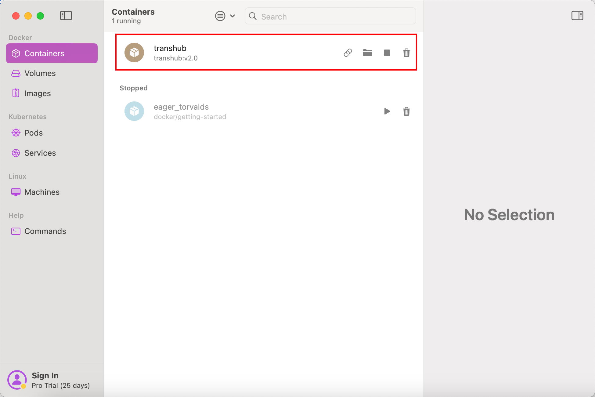

#### 1.2.4. 进入 Transhub 容器

- 首先，确保容器已经启动并正在运行。在执行完 2.3 步后，容器已经处于运行状态。后续若需再次使用容器，则无需再重复执行 2.3
  步骤，可使用以下方法来启动容器。

> `docker run`命令通常用于第一次启动一个新的容器。当你执行 `docker run` 时，Docker 会执行两个步骤：首先，它会从指定的镜像创建一个新的容器（相当于执行了
`docker create` 命令），然后它会启动这个容器，使其变成一个运行中的容器（这一步相当于执行了 `docker start`命令）。因此，
`docker run` 是一个组合命令，它不仅创建容器，还会立即启动容器。如果在系统上找不到指定的镜像，`docker run` 甚至会尝试从
> Docker Hub 拉取镜像。
> 相比之下，`docker start` 命令用于启动一个已经存在的容器。如果你之前已经创建了一个容器（无论是通过 `docker create`
> 创建的，还是之前用 `docker run` 创建并启动过的），你可以使用 `docker start` 来重新启动这个容器。这意味着，使用
`docker start`
> 时，你必须知道要启动的容器的 ID 或名称。

可以运行以下命令查看容器状态：

```bash
docker ps
```

如果容器正在运行，你会看到类似以下的输出：

```bash
CONTAINER ID   IMAGE           COMMAND       CREATED       STATUS       PORTS     NAMES
eecfe24288b1   transhub:v2.0   "/bin/bash"   5 minutes ago Up 5 minutes          transhub
```

如果容器没有运行，可以使用以下命令启动它：

```bash
docker start transhub
```

- 使用 `docker exec` 命令进入容器的 Shell，后续即可在终端中**操作该容器**

```bash
docker exec -it transhub /bin/bash
```

- 接下来可进入容器的目录 `/home/none_root/transhub`，如果一切无误，你应该可以看到已安装好的 mahimahi 和 transhub 文件：

```bash
cd home/none_root/transhub/
ls
```

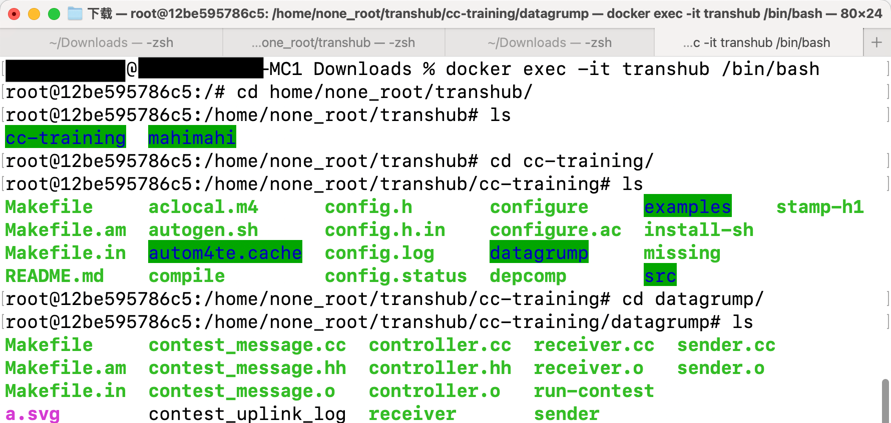

## 2. 运行实验测试

运行 `run-contest`开始测试后，程序将模拟 VerizonLTE 连接大约两分钟，请耐心等待，运行完成时会生成日志。

💡`run-contest`工具负责将测试文件通过模拟 Verizon downlink 生成日志，并使用 mahimahi 仿真，提供传输过程中的性能信息，并显示
queueing delay 和 throughput 随时间变化的折线图。

### 2.1. 通过方式一安装的测试过程

- 运行 `run-contest`开始实验

```bash
sudo sysctl -w net.ipv4.ip_forward=1 #（必须启用Linux的IP转发才能使mahimahi工作）
cd datagrump #（前提已经在cc-training目录下）
./run-contest [scheme_name] #（scheme_name就是你给自己文件命名的名称，第一次使用时可以将[scheme_name] 替换为controller.cc）
```

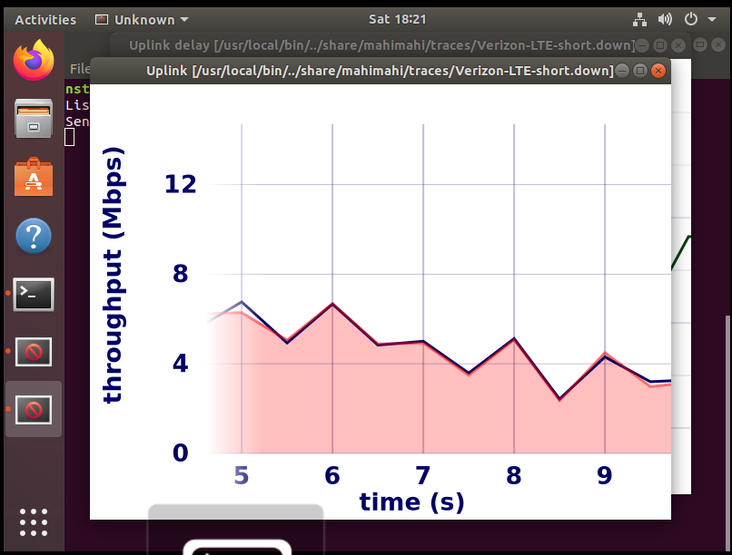

- 使用如下命令获取实验结果

```bash
mm-throughput-graph  500  ./contest_uplink_log > a.svg #（分析日志，输出吞吐等信息,得到svg图）

# 得到以下结果
Average capacity:平均容量
Average throughput:平均吞吐量
95(th) percentile per-packet queueing delay:95%排队延迟
95(th) percentile signal delay:95%信号延迟
```

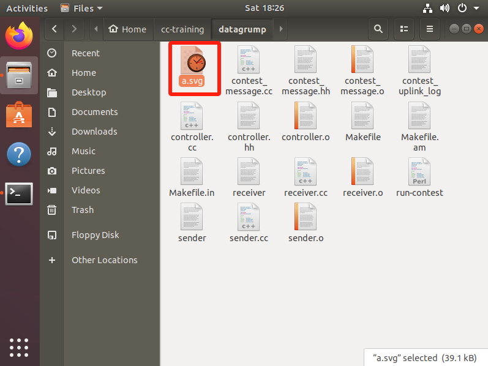

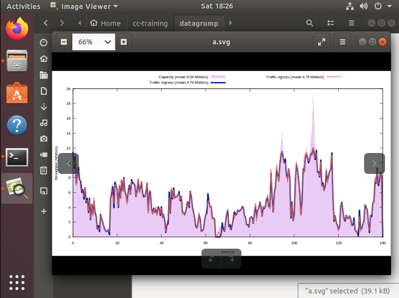

### 2.2. 通过方式二安装的测试过程

❗ 注意，在容器中运行时，运行 `run-contest`需要在非 root 用户下执行，而开启 linux 的 IP 转发以及编译源代码需要在 root 用户下。使用
`su none_root`切换为非 root 用户，使用 `exit`切换回 root 用户。在使用过程中请注意在两种用户间灵活切换。

- 运行 `run-contest`开始实验

```bash
sysctl -w net.ipv4.ip_forward=1 #（必须启用Linux的IP转发才能使mahimahi工作，此操作需在root用户下执行）
cd datagrump #（前提已经在cc-training目录下）
su none_root #（切换为非root用户。若是想再切换回root，只需要输入exit然后按下回车即可）
./run-contest [scheme_name] #（scheme_name就是你给自己文件命名的名称，第一次使用时可以将[scheme_name] 替换为controller.cc）
```

执行命令时，若如下方提示 `please run as non-root`，请使用命令 `su none_root`切换到 non_root 用户。

```bash
root@12be595786c5:/home/none_root/transhub/cc-training/datagrump# ./run-contest  controller.cc
Listening on :::9090
Died on std::runtime_error: mm-delay: please run as non-root

 done.
```

由非 root 用户切换回 root 用户示意图：

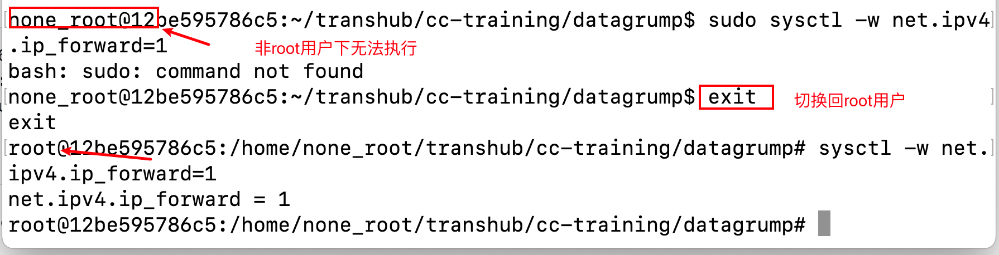

- 使用如下命令获取实验结果

```bash
mm-throughput-graph  500  ./contest_uplink_log > a.svg #（分析日志，输出吞吐等信息,得到svg图）

# 得到以下结果
Average capacity:平均容量
Average throughput:平均吞吐量
95(th) percentile per-packet queueing delay:95%排队延迟
95(th) percentile signal delay:95%信号延迟
```

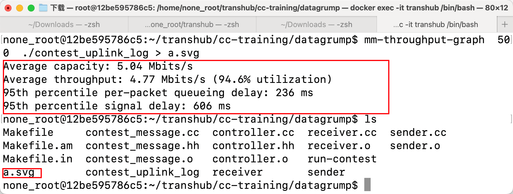

Mac 可通过以下方式找到容器内文件：

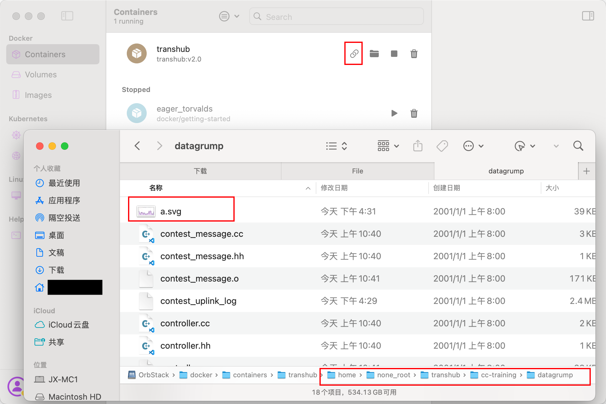

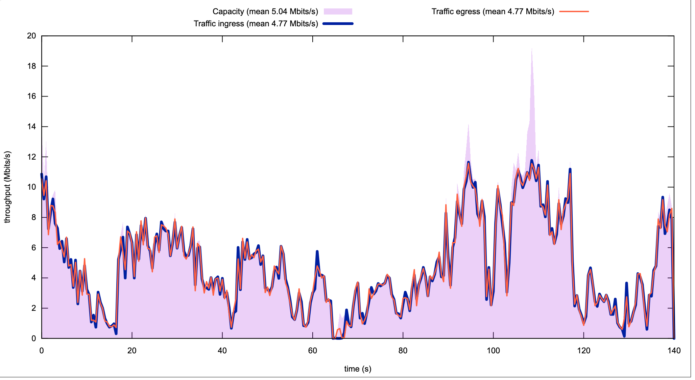

🎉**Congratulations！至此，你已成功安装 transhub，接下来请设计你的算法，并提交验证！**

## 3. 进行算法开发

在 Ubuntu 内安装 vscode 或在宿主机使用 vscode
远程连接到虚拟机（连接方法可查看教程[让 Visual studio code 使用 SSH 连接虚拟机 Ubuntu 开发](https://zhuanlan.zhihu.com/p/681363165)
或搜索关键词 `vscode连接虚拟机`）。

打开代码目录，修改 `controlle.cc`代码，修改完成后，执行 `make`命令编译代码，然后运行测试验证代码效果即可。

如果是使用docker方式安装，由于docker镜像系统版本较低，无法使用最新vscode进行远程连接（弹出如下提示），可以通过目录映射将docker容器内目录映射到宿主机上进行开发。

对于 Mac 用户，Orbstack默认进行了目录挂载，可在vscode中直接打开目录 `~/OrbStack/docker/containers/transhub/home/none_root`

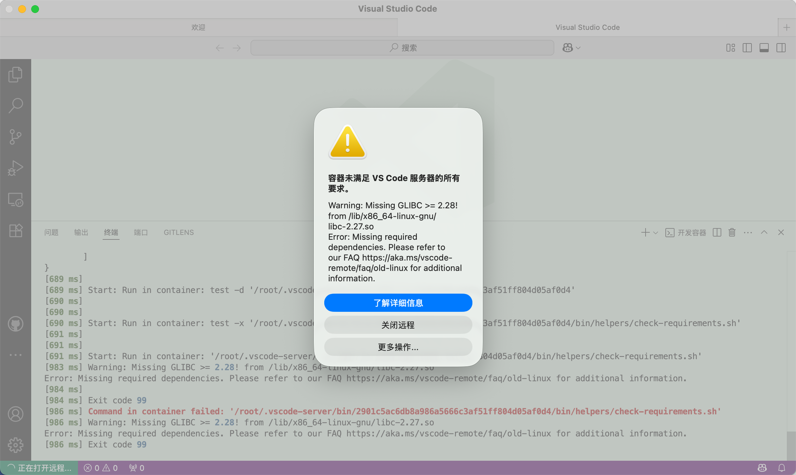

## 4. 系统拥塞控制算法配置（可选）

本节内容介绍了如何查看并修改系统拥塞控制算法，属于**拓展阅读**部分。

Linux 系统中可选的拥塞控制算法包括 `reno`、`cubic`、`bbr`等。本节以配置 `bbr`算法为例：

❗ 配置不同的拥塞控制算法会对传输结果产生不同的影响，可做相关实验验证（此处所指**实验并非**本 transhub 中的 `run-contest`
实验，`run-contest`的拥塞控制算法为 `controller.cc`,与系统拥塞控制算法无关。如需验证系统拥塞控制算法，可使用 `iperf`
等工具来做相关实验）。

### 4.1. 通过方式一安装的操作过程

💡 在 Linux 主机上启用 BBR 算法

```bash
# 查看系统支持的拥塞控制算法
sudo sysctl net.ipv4.tcp_available_congestion_control
# 输出结果：表明当前系统支持reno cubic算法
# net.ipv4.tcp_available_congestion_control = reno cubic

# 查看系统当前使用的拥塞控制算法
sudo sysctl net.ipv4.tcp_congestion_control
# 输出结果：表明当前系统使用cubic算法
# net.ipv4.tcp_congestion_control = cubic

# 切换到BBR
sudo sysctl net.core.default_qdisc=fq
sudo sysctl net.ipv4.tcp_congestion_control=bbr
# 查看是否切换成功
sudo sysctl net.ipv4.tcp_congestion_control

# 切换回CUBIC
sudo sysctl net.core.default_qdisc=pfifo
sudo sysctl net.ipv4.tcp_congestion_control=cubic
# 查看是否切换成功
sudo sysctl net.ipv4.tcp_congestion_control
```

### 4.2. 通过方式二安装的操作过程

💡 在 Docker 容器中启用 BBR 算法

**附相关知识点：Docker 容器共享主机内核**：

- Docker 容器共享宿主机的内核，因此容器内的网络配置（如拥塞控制算法）受宿主机内核限制。
- 如果宿主机内核不支持 BBR，容器内也无法使用 BBR。

> Docker在macOS上和Windows上跑Linux docker都是先套了个虚拟机，虚拟机里跑Linux提供kernel，再在里面跑docker。例如目前虚拟机在Windows上是Hyper-V或者WSL。

**拥塞控制算法**属于**内核算法**，所以在 Docker 容器能够使用的拥塞控制算法受**宿主机内核**确定。bbr算法是较新的算法，并非在所有内核都支持。

使用命令 `sysctl net.ipv4.tcp_available_congestion_control`查看当前支持的拥塞控制算法：

```bash
# 查看系统支持的拥塞控制算法
sysctl net.ipv4.tcp_available_congestion_control
# 输出结果：表明当前系统支持reno cubic算法
# net.ipv4.tcp_available_congestion_control = reno cubic
```

- 如是 Linux 宿主机，可按照 3.1 节方法开启宿主机 bbr 算法，在容器中也将变更为 bbr 算法。
- Mac 若是使用 Orbstack 的容器，可尝试使用 reno 或 cubic 算法。目前暂时没找到打开 bbr 的方法，因为容器内开启 bbr 算法需要**宿主机内核**支持。而在 Orbstack 中，该内核实际上是由 Orbstack 提供的**定制化的内置 Linux 内核**，用户无法修改。
- Windows Docker 若是使用 WSL 后端，暂时不支持该操作。

在 Docker 中切换拥塞控制算法的命令如下：

```bash
# 查看系统支持的拥塞控制算法
sysctl net.ipv4.tcp_available_congestion_control
# 输出结果：表明当前系统支持reno cubic算法
# net.ipv4.tcp_available_congestion_control = reno cubic

# 查看系统当前使用的拥塞控制算法
sysctl net.ipv4.tcp_congestion_control
# 输出结果：表明当前系统使用cubic算法
# net.ipv4.tcp_congestion_control = cubic

#===========若内核支持BBR，使用以下命令切换到BBR以及切回CUBIC
# 切换到BBR
sysctl net.core.default_qdisc=fq
sysctl net.ipv4.tcp_congestion_control=bbr
# 查看是否切换成功
sysctl net.ipv4.tcp_congestion_control

# 切换回CUBIC
sudo sysctl net.core.default_qdisc=pfifo
sudo sysctl net.ipv4.tcp_congestion_control=cubic
# 查看是否切换成功
sudo sysctl net.ipv4.tcp_congestion_control

#===========若内核不支持BBR，例如使用Orbstack，使用以下命令切换到RENO以及切回CUBIC
# 切换到RENO
sysctl net.ipv4.tcp_congestion_control=reno

# 切换到CUBIC
sysctl net.ipv4.tcp_congestion_control=cubic
```

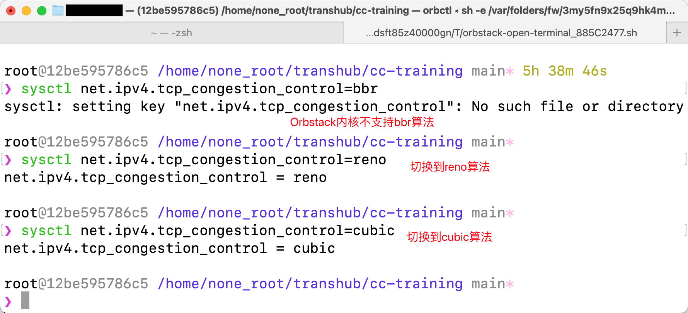


# 常见问题

## 1. 竞赛平台问题

### 1.1. 竞赛平台日志中显示`terminate called after throwing an instance of 'unix_error'`

此日志为正常现象，只要显示的评测时间正确即可，如下图所示：

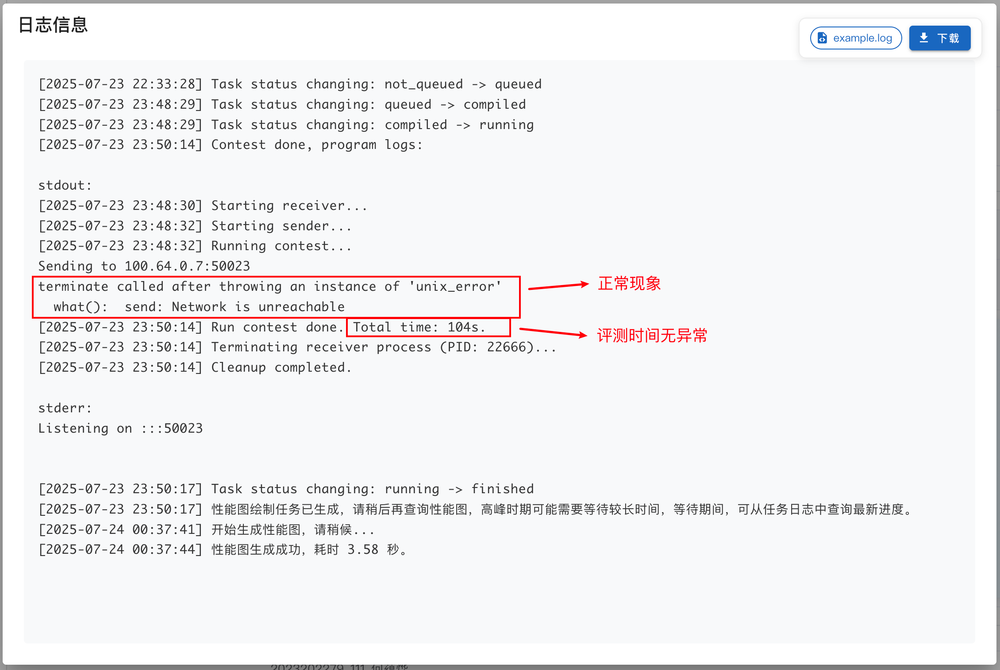

## 2. Transhub安装问题

### 2.1. Ubuntu24 版本默认安装 gnuplot 6.0 导致无法正确绘制流量图

对于 Ubuntu 24 版本，可能默认安装的 gnuplot 为 6.0 版本，将导致后续绘制流量图时出错（绘制的流量图无法正常打开，如下图所示），需要将
gnuplot 降级到 5.4，Ubuntu 22 及以下版本默认安装的是 5.4 版本，不会有此问题。

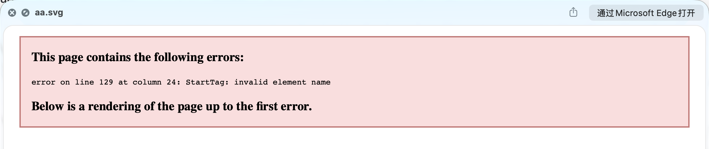

使用以下命令降级到 5.4 版本

   ```sh
   # 1. 卸载当前版本
   sudo apt remove --purge gnuplot

   # 2. 安装编译依赖
   sudo apt update
   sudo apt install build-essential libx11-dev libxt-dev libcairo2-dev libpango1.0-dev

   # 3. 下载5.4.0源码包
   wget https://sourceforge.net/projects/gnuplot/files/gnuplot/5.4.0/gnuplot-5.4.0.tar.gz
   tar xvf gnuplot-5.4.0.tar.gz
   cd gnuplot-5.4.0

   # 4. 编译安装
   ./configure --prefix=/usr/local
   make -j$(nproc)
   sudo make install

   # 5. 创建符号链接
   sudo ln -sf /usr/local/bin/gnuplot /usr/bin/gnuplot

   # 6. 验证版本
   gnuplot --version
   ```

### 2.2. Ubuntu20 版本由于防火墙导致无法运行实验

Ubuntu20、22 版本也可正常完成 transhub 安装，但在运行实验时，需要关闭防火墙，否则实验跑不通。使用以下命令关闭防火墙：

   ```shell
   sudo ufw disable
   ```

### 2.3. WSL 无法正常安装 transhub

根据实测，使用 Windows WSL 无法成功安装 transhub，因此不建议使用 WSL Docker。对于 Windows 用户，同学们可使用 Linux
虚拟机直接安装 transhub 或者在 Linux 虚拟机中使用 Docker。

### 2.4. 丢包环境下 mm-throughput-graph 无法绘制

需要修改 `/usr/local/bin/mm-throughput-graph` 文件使得该脚本能对有丢包事件的日志进行画图操作，具体改动如下图所示（改动之处用红框标出）

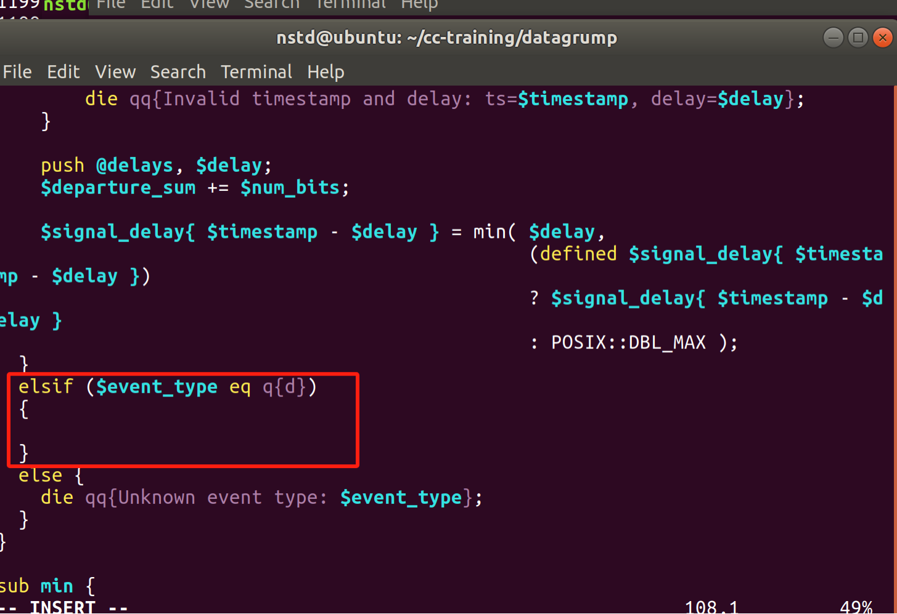

------

本文档更新时间：2025 年 07 月 28日 星期一
